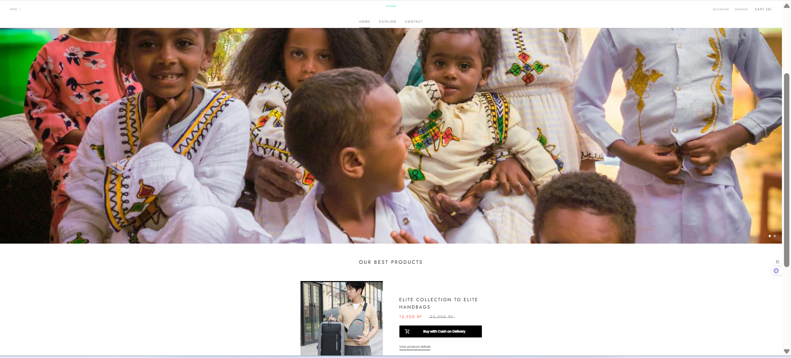
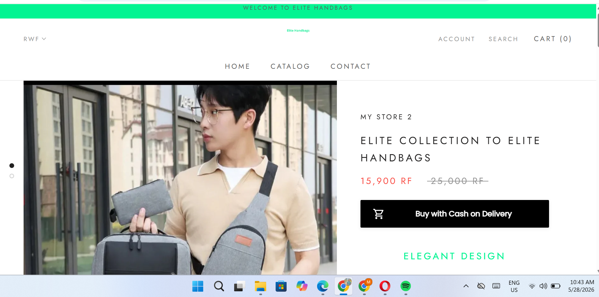
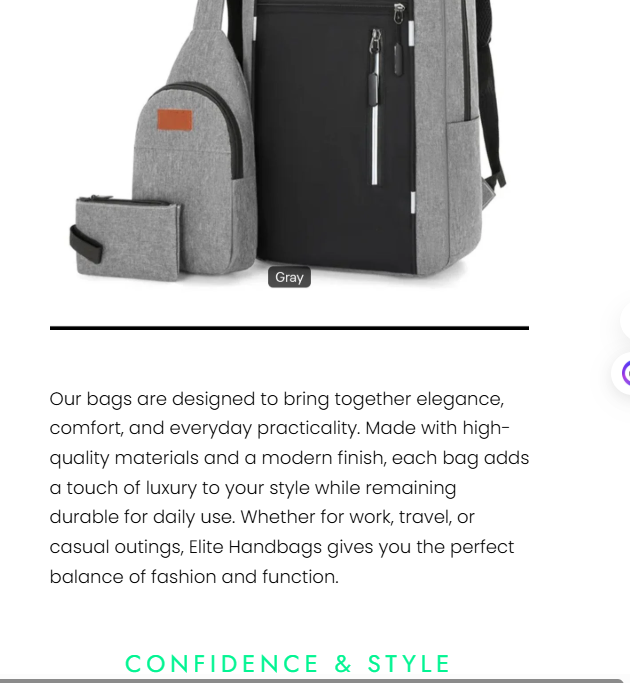
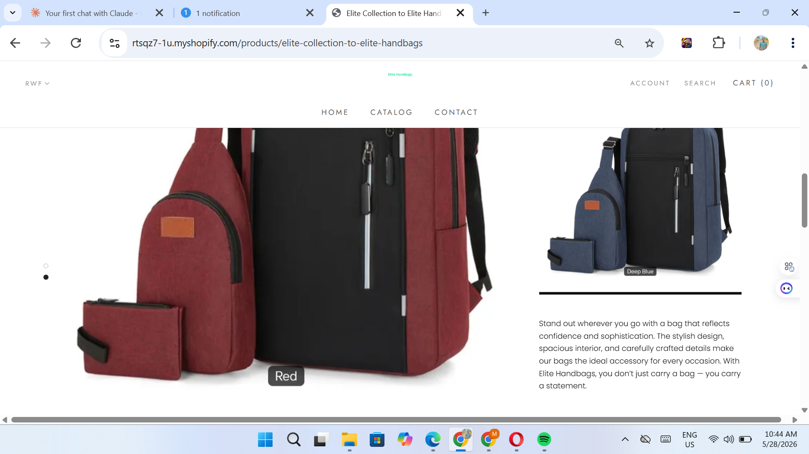
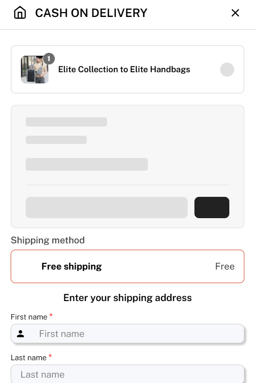
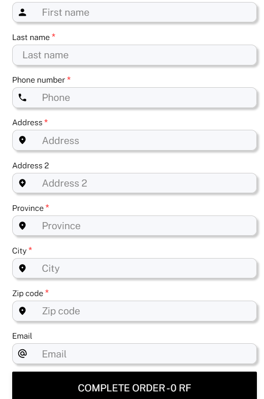

# 🛍️ Elite Handbags — No-Code E-Commerce Application Design Project

---

## 👤 Student Information

| Field | Details |
|-------|---------|
| **Full Name** | Mahamat Ibrahim Mahamat |
| **Registration Number** | 22758/2023 |
| **Department** | Software Engineering |
| **Course** | E-Commerce and Web Application — EWA408510 |
| **Lecturer** | Eric Maniraguha |
| **Academic Year** | 2025–2026 \| Semester II |
| **Submission Date** | May 27, 2026 |

---

## 📌 Project Title

**Elite Handbags** — A Premium Handbag E-Commerce Store

---

## 🛠️ Platform Used

**Shopify** — A No-Code/Low-Code e-commerce platform that allows building and managing online stores without writing code.

- Theme used: **Customized free Shopify theme**
- Currency: **Rwandan Franc (RWF)**
- Payment Method: **Cash on Delivery (COD)**

---

## 🌐 Live Website Link

🔗 [https://rtsqz7-1u.myshopify.com](https://rtsqz7-1u.myshopify.com)

---

## 📁 GitHub Repository Link

🔗 [https://github.com/mahamat6626/elite-handbags](https://github.com/mahamat6626/elite-handbags)

---

## 🏪 About the Store

**Elite Handbags** is a premium online handbag store based in Rwanda, offering stylish and functional bag collections at affordable prices. The store targets fashion-conscious customers who value both elegance and practicality in their everyday accessories.

> *"At Elite Handbags, we believe fashion should be both beautiful and affordable. Every piece is carefully selected to ensure our customers enjoy both luxury and value."*

**Mission:** To bring elegant, high-quality handbags to customers across Rwanda, combining modern design with everyday functionality — all at prices that fit any budget.

---

## ✅ Features Implemented

### 📄 Pages

| Page | Description |
|------|-------------|
| 🏠 Homepage | Store name (Elite Handbags) + welcome banner + hero product section |
| 🛍️ Catalog (Product Page) | Minimum 5 products with images, prices, color variants, and descriptions |
| 📞 Contact Page | Contact form with store information |
| 🛒 Cart | Add-to-cart functionality with cart counter and full checkout flow |

### ⚙️ Functional Features

- ✅ **Add to Cart** — Customers can add handbags to their shopping cart
- ✅ **Cash on Delivery** — Buy with COD button on every product page
- ✅ **Color Variants** — Gray, Red, Deep Blue, and Black options per product
- ✅ **Free Shipping** — Displayed on checkout page
- ✅ **Full Checkout Form** — Name, phone, address, city, province, zip code, email
- ✅ **Cart Counter** — Live cart item count shown in navigation
- ✅ **Search** — Customers can search for products
- ✅ **Account** — Customer account creation and login
- ✅ **Responsive Design** — Works on both mobile and desktop
- ✅ **RWF Currency** — All prices displayed in Rwandan Francs

---

## 📦 Products Listed

| # | Product Name | Price (RWF) | Colors Available |
|---|-------------|-------------|-----------------|
| 1 | Elite Collection Handbag — Gray | 15,900 RWF ~~25,000 RWF~~ | Gray |
| 2 | Elite Collection Handbag — Red | 15,900 RWF | Red |
| 3 | Elite Collection Handbag — Deep Blue | 15,900 RWF | Deep Blue |
| 4 | Elite Collection Handbag — Black | 15,900 RWF | Black |
| 5 | Elite Collection Handbag — Full Set | 15,900 RWF | Multiple Colors |

> Each set includes: **Backpack + Sling Bag + Wallet combo**

---

## 📸 Screenshots

### 🏠 1. Homepage


### 🛍️ 2. Product Page — Elite Collection


### 🎨 3. Product Variants (Red & Deep Blue)


### ⬛ 4. Product Description — Black Edition


### 🛒 5. Cart / Cash on Delivery Checkout


### 📋 6. Shipping Address Form


---

## 📁 Repository Structure

```
elite-handbags/
├── README.md               # Full project documentation
├── homepage.png.png        # Screenshot — Homepage
├── product-page.png.png    # Screenshot — Product Page
├── product-variants.png.png # Screenshot — Color Variants
├── product-description.png.png # Screenshot — Product Description
├── cart-checkout.png.png   # Screenshot — Cart & Checkout
└── shipping-form.png       # Screenshot — Shipping Address Form
```

---

## ⚠️ Challenges Faced

1. **Setting up Cash on Delivery** — Shopify's default payment methods required finding and configuring a COD app, which took extra research and time.
2. **Currency Configuration** — Setting RWF (Rwandan Franc) as the store currency required navigating Shopify's payment and market settings carefully.
3. **Product Variant Management** — Adding multiple color variants (Gray, Red, Blue, Black) with separate images for each variant required careful product editing.
4. **Theme Customization** — Learning how to customize the free Shopify theme without coding while maintaining a professional look was a hands-on learning process.
5. **Image Optimization** — Ensuring product images were clear, consistent, and well-sized across all product listings took extra effort.
6. **GitHub & Markdown** — Learning how to write proper Markdown documentation and manage files in a GitHub repository was a completely new skill.

---

## 📚 Lessons Learned

1. **No-Code platforms are powerful** — Shopify allows building a professional e-commerce store without writing a single line of code, which is very impressive.
2. **GitHub is essential for developers** — I learned how to create a repository, write Markdown documentation, and manage project files using GitHub.
3. **User Experience matters** — Designing pages that are easy to navigate and visually appealing is just as important as the products themselves.
4. **E-commerce has many moving parts** — Running an online store involves product management, payment setup, shipping, customer contact, and marketing all working together.
5. **Documentation is part of the project** — Writing a clear README.md helped me reflect on the work I did and communicate it professionally.
6. **Product presentation is key** — Good product images and clear descriptions directly impact how professional a store looks and feels.

---

## 🔧 Tools & Technologies Used

- **Shopify** — E-commerce platform (No-Code)
- **Shopify Free Theme** — Store design and layout
- **GitHub** — Version control and project documentation
- **Markdown** — Documentation language for README.md

---

> *"Your project is not just an assignment — it is part of your professional portfolio."*
> — Eric Maniraguha, Lecturer EWA408510
